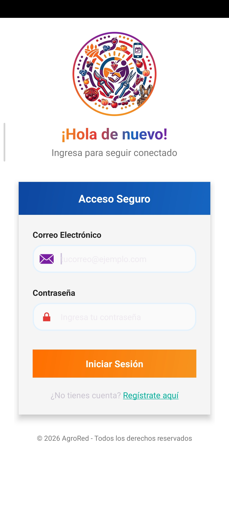
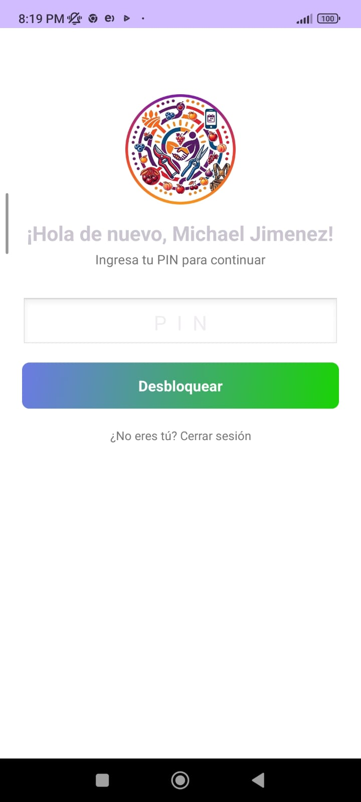
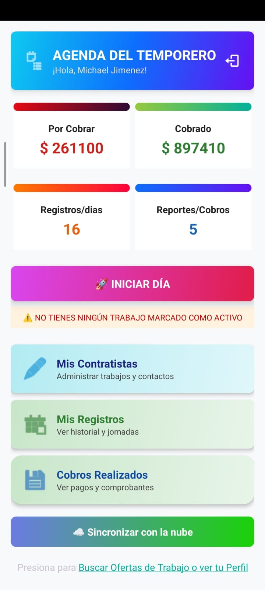
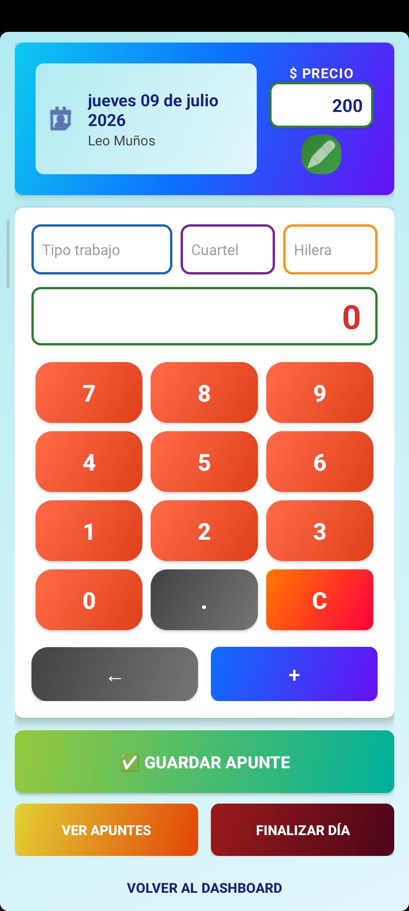
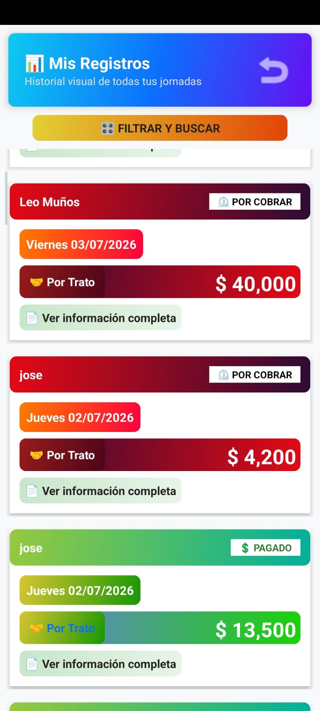
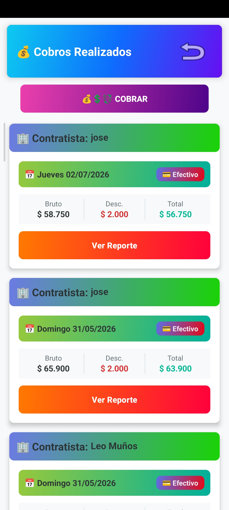
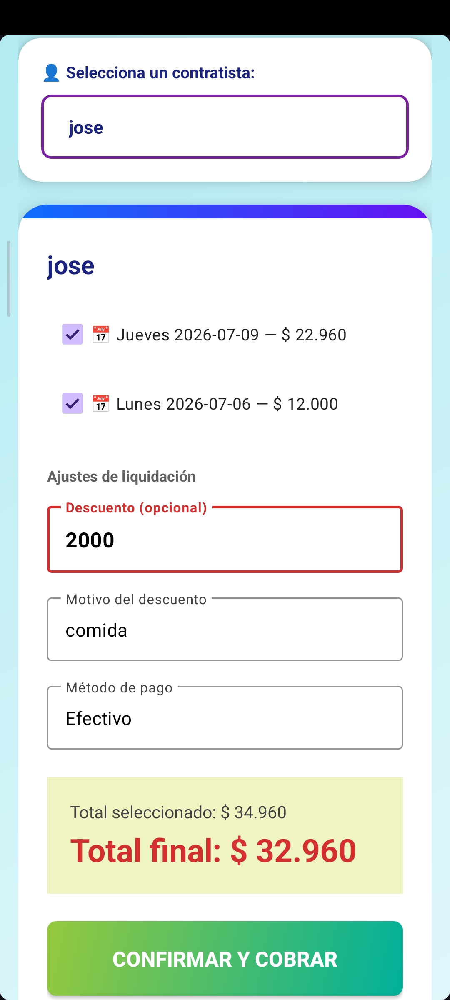
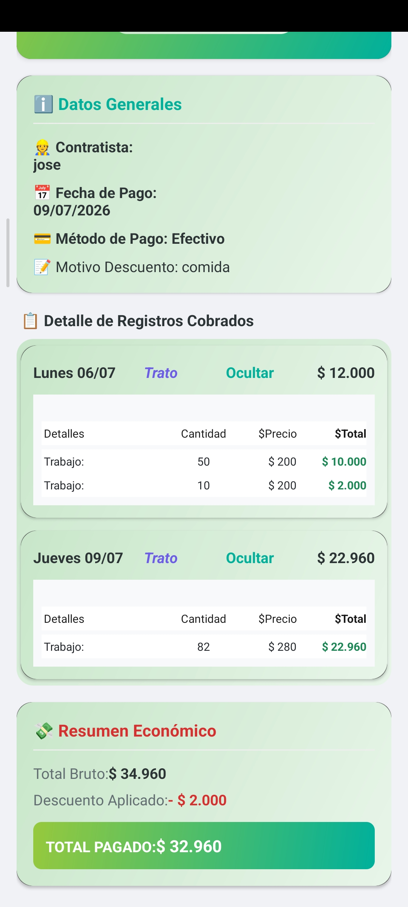
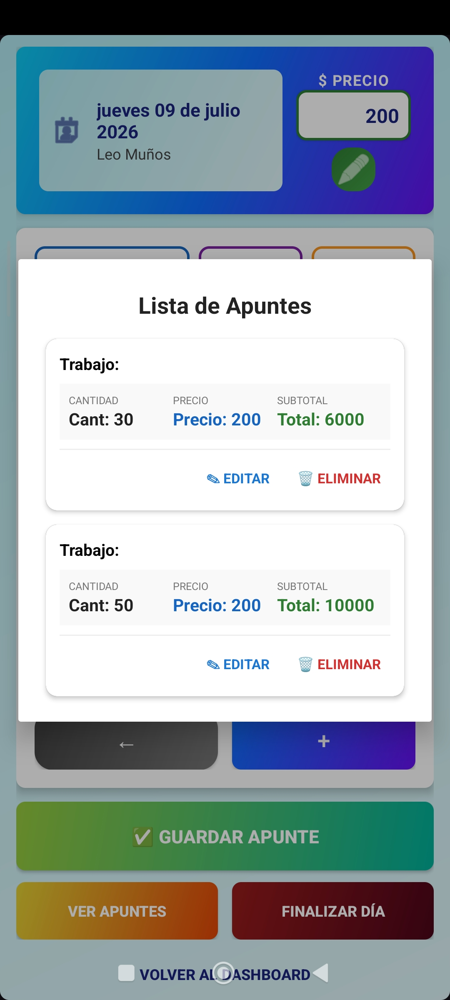

## 🚀 Próximo lanzamiento: AGRORED v3.0

Estamos trabajando en una nueva actualización enfocada en ofrecer una experiencia más rápida, estable y con una mejor respuesta en tiempo real (Realtime).

Mientras llega AGRORED v3.0, continuaremos publicando nuevas versiones de la rama **v2.x**, incorporando mejoras de rendimiento, corrigiendo errores e implementando nuevas funcionalidades para seguir fortaleciendo la aplicación.

💚 Gracias por acompañarnos en el crecimiento de AGRORED. Mantente atento a las próximas actualizaciones y lanzamientos.

# 🌿 AGRORED

Aplicación Android para la gestión y control de jornadas agrícolas.

---

# 📱 Última versión

## 🟢 AGRORED v2.3.1

### 📥 Descargar APK

👉 **https://github.com/maycoljimenez65-prog/app-AgroRed/releases/latest**

---

# 🚀 Novedades de la versión 2.3.1

## 🎨 Mejoras en la interfaz

- ✅ Rediseño de diferentes pantallas para ofrecer una experiencia más cómoda y agradable.
- ✅ Reorganización de elementos visuales para facilitar el uso de la aplicación.
- ✅ Mejor distribución de la información en varias secciones.

## 📋 Gestión de información

- ✅ Se añadieron nuevos campos informativos en la vista de contratistas.
- ✅ Ahora es posible visualizar información más completa de cada contratista.
- ✅ Se incorporaron campos adicionales al registrar los apuntes diarios.
- ✅ Mejor organización de los datos registrados durante la jornada laboral.

## ⚡ Mejoras generales

- ✅ Interfaz más intuitiva y fácil de utilizar.
- ✅ Corrección de pequeños errores reportados por los usuarios.
- ✅ Optimización de la experiencia de navegación.
- ✅ Mayor estabilidad general de la aplicación.

---

# 📸 Capturas

<table>
<tr>
<td></td>
<td></td>
<td></td>
</tr>

<tr>
<td align="center"><b>Login</b></td>
<td align="center"><b>PIN</b></td>
<td align="center"><b>Dashboard</b></td>
</tr>
<tr>
<td></td>
<td></td>
<td></td>
</tr>

<tr>
<td align="center"><b>Nuevo Dia</b></td>
<td align="center"><b>Registros</b></td>
<td align="center"><b>Cobros</b></td>
</tr>

<tr>
<td></td>
<td></td>
<td></td>
</tr>

<tr>
<td align="center"><b>Cobrar</b></td>
<td align="center"><b>Ver Reporte de Cobro</b></td>
<td align="center"><b>Apuntes del Dia</b></td>
</tr>
</table>

---

# 📦 Historial de versiones

| Versión | Estado | Fecha |
|---------|--------|--------|
| 🟢 v2.3.1 | Mejoras de usabilidad, Corrección de errores  | 10/07/2026 |
| 🟢 v2.3.0 | Renovación visual, nuevos campos informativos y mejoras de usabilidad | 09/07/2026 |
| 🟢 v2.2.0 | Estabilidad del modo Offline y mejoras del servicio de respaldo en tiempo real | 08/07/2026 |
| 🔵 v2.1.2 | Acceso mediante PIN y huella, funcionamiento 100% Offline después del primer inicio de sesión | 05/07/2026 |
| 🔴 v2.1.1 | Corrección de errores del modo Offline | 05/07/2026 |
| 🟠 v2.1.0 | Integración de PIN y autenticación biométrica | 04/07/2026 |
| 🟣 v2.0.0 | Implementación del modo Offline y sincronización manual | 04/07/2026 |
| 🔵 v1.0.1 | Corrección de errores y mejoras de estabilidad | 01/07/2026 |
| ⚪ v1.0.0 | Primera versión estable | 27/06/2026 |

---

# 📲 Características principales

- 👨‍🌾 Gestión de contratistas.
- 📅 Registro de jornadas diarias.
- 📝 Registro de apuntes de trabajo.
- 💰 Gestión de cobros y pagos.
- 📊 Historial de registros.
- 📴 Funcionamiento completamente Offline.
- ☁️ Sincronización manual con la nube.
- 🔄 Respaldo de información mediante servicio Realtime.
- 🔐 Acceso mediante PIN de seguridad.
- 👆 Compatibilidad con autenticación biométrica (huella dactilar).

---

# 📲 Requisitos

- Android 8.0 (API 26) o superior.
- Internet únicamente para sincronizar y respaldar la información.
- Sensor biométrico (opcional) para utilizar el acceso mediante huella.

---

# 👨‍💻 Desarrollador

**Michael Jimenez Ugarte**
Frase de inspiracion:"Un buen desarrollador no se define por la cantidad de código que escribe, sino por la cantidad de problemas que resuelve sin crear otros nuevos."
Proyecto desarrollado para facilitar el registro y control de trabajos agrícolas desde dispositivos Android, con funcionamiento Offline y sincronización segura de la información.

---

# ⭐ ¿Te gustó AGRORED?

Si AGRORED te fue útil, considera dejar una ⭐ en este repositorio y compartir la aplicación.
