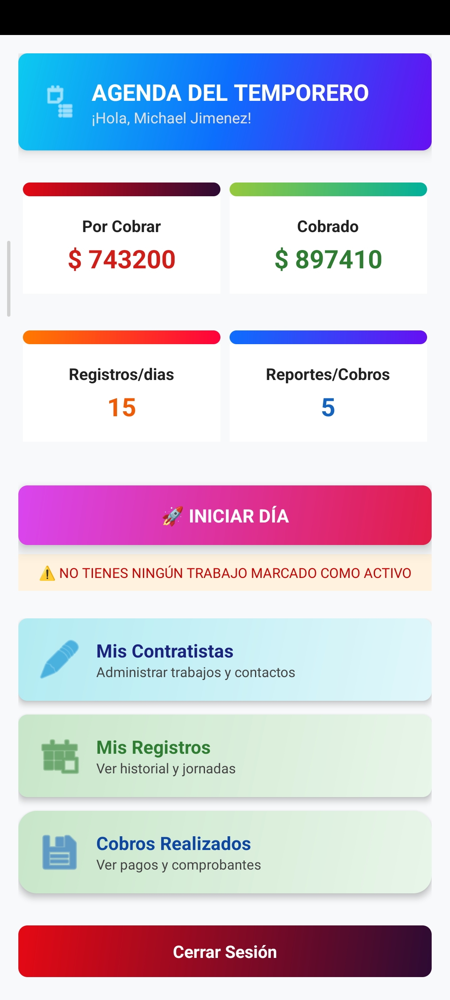

# 🌿 AGRORED

Aplicación Android para la gestión y control de jornadas agrícolas.

---

# 📱 Última versión

## 🟢 AGRORED v2.0.0

### 📥 Descargar APK

👉 **https://github.com/maycoljimenez65-prog/app-AgroRed/releases/latest**

---

# 🚀 Novedades de la versión 2.0.0

## 🌟 Nueva funcionalidad principal

- ✅ Implementación del **modo Offline**.
- ✅ La aplicación funciona sin conexión a Internet.
- ✅ Los registros se almacenan localmente en el dispositivo.
- ✅ Sincronización manual con la nube para respaldar la información.
- ✅ Mayor estabilidad en zonas con poca o nula cobertura de Internet.

## ⚡ Mejoras

- Optimización del rendimiento general.
- Mejor experiencia de usuario.
- Mayor velocidad de respuesta.
- Corrección de errores menores detectados en versiones anteriores.

---

# 📸 Capturas

| Login | Dashboard |
|-------|-----------|
|  |  |

| Nuevo Día | Cobros |
|-----------|--------|
|  |  |

---

# 📦 Historial de versiones

| Versión | Estado | Fecha |
|---------|--------|--------|
| 🟢 v2.0.0 | Actual | 04/07/2026 |
| 🔵 v1.0.1 | Corrección de errores y mejoras de estabilidad | 01/07/2026 |
| ⚪ v1.0.0 | Primera versión estable | 27/06/2026 |

---

# 📲 Características principales

- 👨‍🌾 Gestión de contratistas.
- 📅 Registro de jornadas diarias.
- 📝 Registro de apuntes de trabajo.
- 💰 Gestión de cobros y pagos.
- 📊 Historial de registros.
- ☁️ Sincronización manual con la nube.
- 📴 Funcionamiento completamente Offline.

---

# 📲 Requisitos

- Android 8.0 (API 26) o superior.
- Internet únicamente para sincronizar los datos con la nube.

---

# 👨‍💻 Desarrollador

**Michael Jimenez Ugarte**

Proyecto desarrollado para facilitar el registro y control de trabajos agrícolas desde dispositivos Android.

---

# ⭐ ¿Te gustó AGRORED?

Si AGRORED te fue útil, considera dejar una ⭐ en este repositorio y compartir la aplicación.
